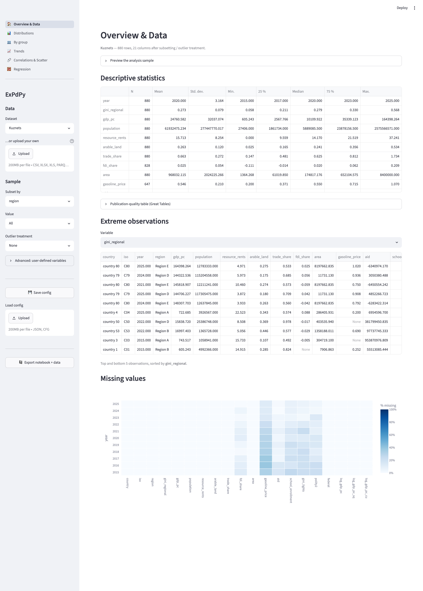
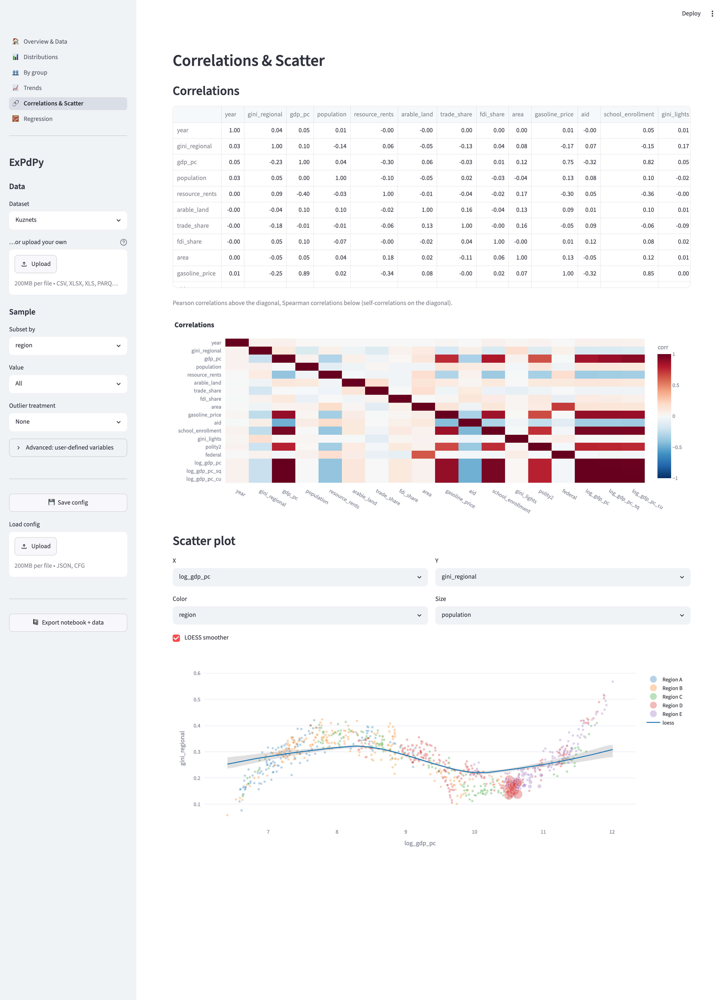
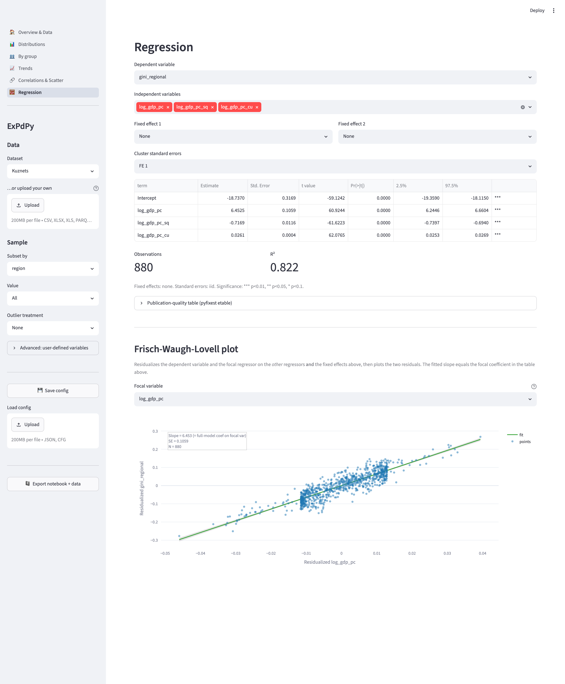

`ExPdPy` also ships as a [Streamlit](https://streamlit.io/) app — the same no-code interface
as the [Shiny version](using-shiny.qmd), reorganised into a **multipage layout** with native,
sortable tables, and ready to deploy on [Streamlit Community Cloud](https://streamlit.io/cloud).
It is provided by the `streamlit` extra:

```bash
pip install "expdpy[streamlit] @ git+https://github.com/cmg777/expdpy.git"
# or, with uv:
uv pip install "expdpy[streamlit] @ git+https://github.com/cmg777/expdpy.git"
```

Once published to PyPI, `pip install "expdpy[streamlit]"` will work directly.

## Launching on a DataFrame

```python
from expdpy.streamlit_app import ExPdPy
from expdpy.data import load_kuznets, load_kuznets_data_def, get_config

ExPdPy(
    load_kuznets(),
    df_def=load_kuznets_data_def(),     # identifies the panel dimensions (country x year)
    config_list=get_config("kuznets"),  # opens on the N-shaped Kuznets curve
)
```

This serializes your data to a temporary bundle and starts `streamlit run` in a subprocess,
opening a browser. The **sidebar** holds the global pipeline — dataset/sample picker, file
upload, subset filter, outlier treatment, user-defined variables, and config save/load +
notebook export — and the analysis components are grouped into pages you switch between in the
navigation menu.



## The pages

| Page | Components |
|---|---|
| **Overview & Data** | sample preview, descriptive statistics, extreme observations, missing-value heatmap |
| **Distributions** | histogram, category bar chart |
| **By group** | group means (bar), distribution (violin), group means over time |
| **Trends** | variable trend (1–3 series), quantile trend |
| **Correlations & Scatter** | correlation table + heatmap, scatter with color/size/LOESS |
| **Regression** | OLS with fixed effects and clustered standard errors |

Time-series pages and components (Trends, missing values, by-group trend) are **hidden
automatically for cross-sectional data** — exactly as in the Shiny app.





## The dataset picker and upload

Launched without data — or deployed to the Cloud — the app starts with a **dataset picker**
(defaulting to Kuznets; also Gapminder / World Bank / Russell 3000) and a file uploader. An
uploaded CSV / Excel / Parquet file overrides the selected dataset:

```python
from expdpy.streamlit_app import ExPdPy

ExPdPy()  # bundled-dataset picker + upload box
```

## Cross-sectional data

Omit the time-series identifier and the time-trend pages/components disappear:

```python
ExPdPy(load_kuznets().query("year == 2025"))  # no ts_id -> cross-sectional
```

## The sample pipeline

The sidebar's **Subset by** / **Value** selectors restrict the sample to one level of a factor,
and **Outlier treatment** winsorizes or truncates the numeric columns at the 1st/99th or
5th/95th percentile. Every component downstream reflects the prepared sample.

## User-defined variables

Expand **Advanced: user-defined variables** to compute new variables from the base data with
safe expressions (column references plus `+ - * / ** %`, comparisons, `& |`, and the functions
`isna`, `exp`, `log`, `lag`, `lead`; `lag`/`lead` are panel-aware). When any row is filled, the
analysis runs on the defined variables.

::: {.callout-note}
Expressions are evaluated with a restricted AST walker — never `eval`/`exec` — shared with the
Shiny app, so configurations are interchangeable between the two apps.
:::

## Saving configurations and reproducible export

**Save config** downloads the current selections as JSON; **Load config** restores them. The
format is identical to the Shiny app's, so a config saved in one app loads in the other.
**Export notebook + data** downloads a zip with the prepared sample (parquet) plus a Jupyter
notebook and a `.py` script that recreate every displayed component with `expdpy` calls.

## Deploying on Streamlit Community Cloud

The repository ships a thin entry script, `streamlit_app.py`, that the Cloud points at (or run
it locally):

```bash
streamlit run streamlit_app.py
```

::: {.callout-tip}
On Streamlit Community Cloud, set the app's main file to `streamlit_app.py` and add `expdpy`
(with the `streamlit` extra) to the environment. The app starts with the dataset picker and
upload box — no code required.
:::
